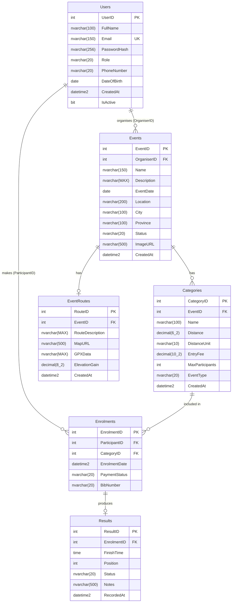

# RaceDay – Entity Relationship Diagram

> Render this diagram using [mermaid.live](https://mermaid.live) or the VS Code Mermaid extension, then export as PNG and save as `ERD.png` in this folder.

## Entity Descriptions

| Entity | Description |
|--------|-------------|
| **Users** | Both Organisers and Participants are stored in the same Users table. The role of each user is defined in the `Role` column. |
| **Events** | These represent road running, walking, or cycling races organised by users with the Organiser role. |
| **Categories** | These define race types within an event (for example, 5K Run, 10K Run, 21K Walk). |
| **EventRoutes** | Optional map and route information that may be associated with an event. Each EventRoutes record maps to exactly one Event. |
| **Enrolments** | Records a Participant's registration for a specific Category. A unique constraint ensures no participant can enrol in the same category more than once. |
| **Results** | Records finish times and positions entered by an Organiser after the event. Each Results record is linked to exactly one Enrolment. |

## Cardinality Notes

- A User (Organiser) can create many Events (one-to-many).
- An Event can have many Categories (one-to-many).
- An Event will never have more than one Route (one-to-one).
- A User (Participant) can make many Enrolments (one-to-many).
- A Category can be associated with many Enrolments (one-to-many).
- One Enrolment will produce no more than one Result (one-to-one).
