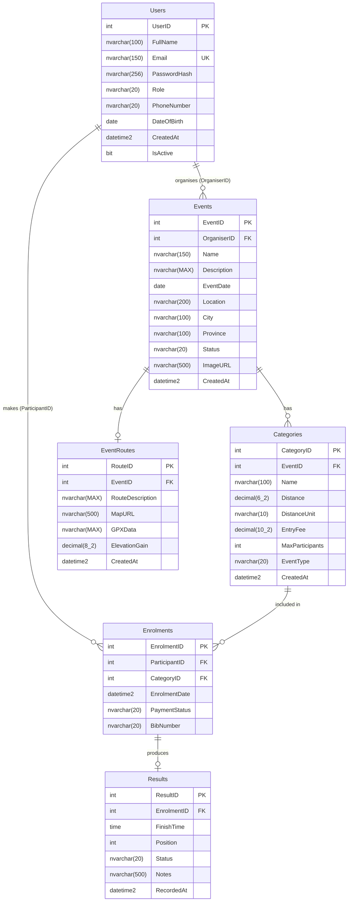

# RaceDay – Entity Relationship Diagram

> Render this diagram using [mermaid.live](https://mermaid.live) or the VS Code Mermaid extension, then export as PNG and save as `ERD.png` in this folder.

## Entity Descriptions

| Entity | Description |
|--------|-------------|
| **Users** | Single table for both Organisers and Participants, distinguished by the `Role` column. |
| **Events** | Road running, walking, or cycling events created by Organisers. |
| **Categories** | Race categories within an event (e.g. 5K Run, 10K Run, 21K Walk). |
| **EventRoutes** | Optional route/map data attached to an event. One-to-one with Events. |
| **Enrolments** | A Participant's entry into a specific Category. Enforces unique per participant per category. |
| **Results** | Finish time and position recorded by an Organiser after the event. One-to-one with an Enrolment. |

## Cardinality Notes

- A **User** (Organiser) can organise **many Events** (one-to-many).
- An **Event** can have **many Categories** (one-to-many).
- An **Event** has **at most one Route** (one-to-one).
- A **User** (Participant) can have **many Enrolments** (one-to-many).
- A **Category** can have **many Enrolments** (one-to-many).
- An **Enrolment** produces **at most one Result** (one-to-one).
