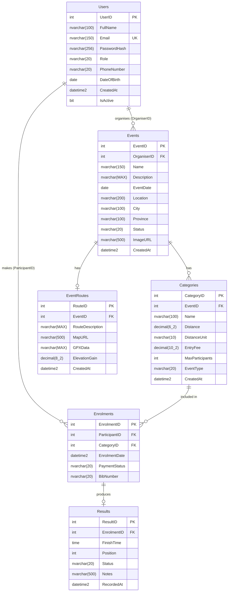

# RaceDay – Entity Relationship Diagram

> Render this diagram using [mermaid.live](https://mermaid.live) or the VS Code Mermaid extension, then export as PNG and save as `ERD.png` in this folder.

## Entity Descriptions

| Entity | Description |
|--------|-------------|
| **Users** | Both Organisers and Participants are stored in the same Users table. The role of each user is defined in the `Role` column. |
| **Events** | These represent road running, walking, or cycling races organised by users with the Organiser role. |
| **Categories** | These define race types within an event (for example, 5K Run, 10K Run, 21K Walk). |
| **EventRoutes** | Optional map and route information that may be associated with an event. Each EventRoutes record maps to exactly one Event. |
| **Enrolments** | Records a Participant's registration for a specific Category. A unique constraint ensures no participant can enrol in the same category more than once. |
| **Results** | Records finish times and positions entered by an Organiser after the event. Each Results record is linked to exactly one Enrolment. |

## Cardinality Notes

- A User (Organiser) can create many Events (one-to-many).
- An Event can have many Categories (one-to-many).
- An Event will never have more than one Route (one-to-one).
- A User (Participant) can make many Enrolments (one-to-many).
- A Category can be associated with many Enrolments (one-to-many).
- One Enrolment will produce no more than one Result (one-to-one).

## Design Decisions

**Single Users table for both roles**
A single Users table stores both Organisers and Participants, differentiated by a `Role` column. This simplifies authentication because the login logic is identical for both roles — the JWT token simply encodes the role claim. It also avoids the complexity of joining separate tables when validating permissions on every API request. If role-specific profile fields were needed in future, a separate `OrganizerProfiles` or `ParticipantProfiles` extension table could be added without breaking existing foreign key relationships.

**CASCADE DELETE on Categories and EventRoutes**
Both Categories and EventRoutes use `ON DELETE CASCADE` on their foreign keys to Events. When an Organiser deletes an event, all associated categories and the route record are automatically removed. This keeps the database consistent without requiring the API layer to issue multiple DELETE statements. Enrolments deliberately do not cascade from Categories, as preserving enrolment history (and therefore result history) is treated as more important than automatic cleanup.

**Composite UNIQUE constraint on Enrolments**
The `UQ_Enrolment_ParticipantCategory` constraint spans `(ParticipantID, CategoryID)`. This enforces the business rule that a participant may only enter a given category once, at the database level rather than relying solely on application-layer validation. A database-level constraint is the safest location for this rule because it remains enforced even if the rule is accidentally bypassed in API code.

**Results links to Enrolments, not directly to Users**
The Results table references `EnrolmentID` rather than `UserID`. An Enrolment already carries the participant identity, the specific category, and therefore the event. Linking directly to the Enrolment means a result always has full context (who, which event, which category, which bib number) without requiring additional joins through Users. It also enforces that a result cannot exist without a corresponding enrolment, which models the real-world process correctly.

**EventRoutes as a separate table**
Route information is stored in a dedicated EventRoutes table rather than as extra columns on Events. Many events may not have a published route at all, so keeping route data separate avoids a wide Events table with numerous nullable columns. It also makes the `UNIQUE (EventID)` constraint straightforward to express and allows route records to be inserted, updated, or deleted independently of the event record itself.

**Status fields use CHECK constraints, not lookup tables**
The Status columns on Events, Enrolments, and Results use `CHECK` constraints (for example `CK_Events_Status`) instead of foreign keys to separate lookup tables. For a small, stable set of values that will rarely change this avoids the overhead of additional tables and joins on every query. The allowed values are clearly visible in the schema definition itself, making it easy to understand the lifecycle of each entity without cross-referencing another table.
